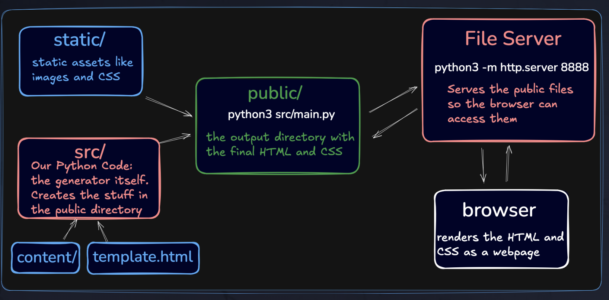

# Prerequisites

Install [Devbox](https://www.jetify.com/docs/devbox/quickstart/)

# Development

To setup the development environment run `devbox shell`. Then you can execute
commands like `main.sh` or the site generator main.py directly.

## Architecture

